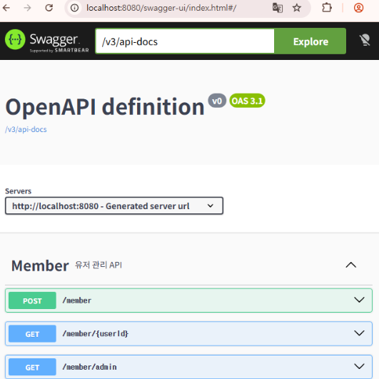
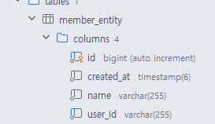

# Swagger (springdoc)
### 설치방법
`implementation 'org.springdoc:springdoc-openapi-starter-webmvc-ui:3.0.2'`
- 주의사항 : 딱 한주 전에!!! spring 4.0 서포트가 추가되었음! 3.0.2 사용하면 된다.
### 공부한거
- @Tag 사용해서 Controller 단위로 태깅 가능
    - @Tag(name = "Member", description = "회원관리용 API")
- @Operation 이용해서 엔드포인트별 설명 붙이기 가능
    - @Operation(summary = "회원가입", description = "새로운 유저 등록!")
- DTO에도 어노테이션 다는것이 가능하다! pydantic Field처럼!
    - @Schema(description = "사용자 id", example = "omija")이런식으루



- 기본 url 은 /swagger-ui/index.html/이다.

# Mixin
### created_at column 을 mixin 으로 넣고 싶었다. (Hibernate)
```java
@MappedSuperclass
@Getter
public class CreatedAtEntity {
  @CreationTimestamp
  @Column(name = "created_at", updatable = false, nullable = false)
  private LocalDateTime createdAt;
}
```
- 위 처럼 MappedSuperclass 로 지정해주고 CreationTimestamp를 넣어주면 된다.
- 사용하는 측에서는 extends 해주면 된다.


# JPA Relationship
### User 와 Post 를 Many to Many relationship으로 연결하고 싶었다.
- 복합키를 PK 로 쓰려면 이 복합키에 해당하는 class 를 따로 @Embeddable로 만들어줘야됨
  - 이후 실제 relationship entity 에서 @EmbeddedId로 불러줘야한다
  - @MapsId 로 위에서 선언한 외래키를 PK로 매칭시켜줘야한다.
- @JoinColumn 으로 실제 DB에 생성될 FK 컬럼명을 지정해준다
  - user_id UUID REFERENCES users(id) <-- 이거 하는거임
- @OnDelete 로 DB 레벨의 ON DELETE 를 설정해준다
  - @OneToMany 등에 cascade 설정해주는건 JPA 레벨에서 해주는것! 하나씩 찾아서 지워줌. 부모의 행위를 전파!
- orphanRemoval은 컬렉션과 관련있는것. 컬렉션에서 삭제되면 자동으로 지우는것!
- 결국 OnDelete 랑 OneToMany에 cascade 잡아주는거 역할은 같음. 다만 직접 쿼링이나 JPA를 거치치 않을 때 등의 사건에서 DB레벨의 안전망을 잡아두는것
