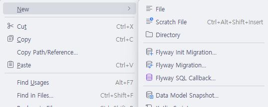
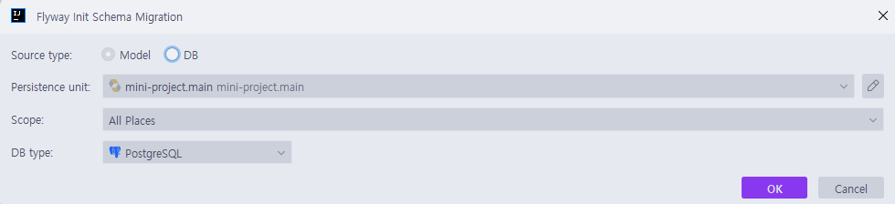
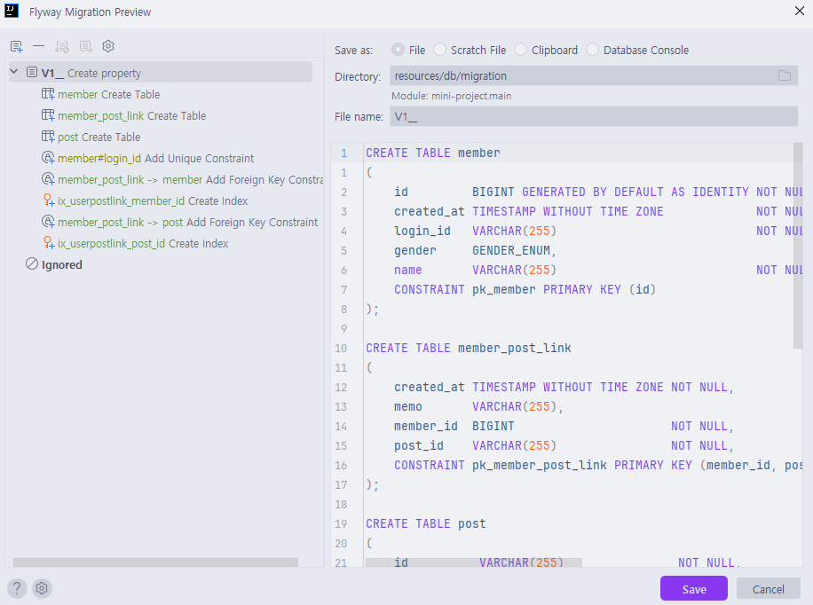
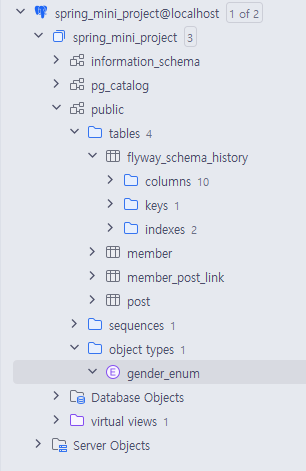

# 프로젝트 기획
### 동기
* 기획 없이 그냥 공부만 하려니까 동기부여가 안됨...
* 뭐라도 기획을 해야 그걸 목표로 달릴 수 있을 것 같아서 프로젝트 하나 기획했음
### 프로젝트 조건
* 무조건 내가 당장 쓸 서비스여야함
* 기술적으로 어느정도 복잡성이 있어야함
* 기왕이면 LLM이나 API 붙이고 싶음
### AI 사진일기 서비스, `타임캡슐`
* 자세한 기획은 README.md 참고

# Flyway
* flyway를 적용시켜봤음

### mvnrepository
* 자바 진영은 패키지가 좀 파편화되어있는듯 함...
  * [mvnrepository](https://mvnrepository.com/) <- 여기 많이 참고한다고 한다.
  * 패키지 검색하고 아래 버전 누르면 적용법 나옴! 그거 대로 적용하면 됨

### install
* flyway는 원래 flyway-core가 모든 DB 호환을 맞춰줬는데, 점점 지원 DB가 늘어나면서 이제는 분리됨

`implementation 'org.springframework.boot:spring-boot-starter-flyway'`
* 일단 이거 추가해주고, 사용하는 DB에 맞게

`runtimeOnly 'org.flywaydb:flyway-database-postgresql'`
* 의존성 추가해주면 된다.

### application.yaml
```yaml
  jpa:
    hibernate:
      ddl-auto: validate
  flyway:
    enabled: true
```
* 이제 ddl-auto는 validate(DB랑 상태 확인만)으로 바꾸고 flyway 관련 설정 넣어주면 된다

### migration 파일 추가



* 자동생성도 어느정도는 지원해준다.
* 물론 alembic도 그러하듯이, 직접 수정해줘야되는 부분들이 있다.
  * member의 gender만 봐도 알 수 있는데, GENDER_ENUM이라는 데이터타입은 자동으로 안만들어준다.
```sql
CREATE TYPE GENDER_ENUM AS ENUM('M','F')
```
* DDL에 직접 써줘야된다


* 어메이징